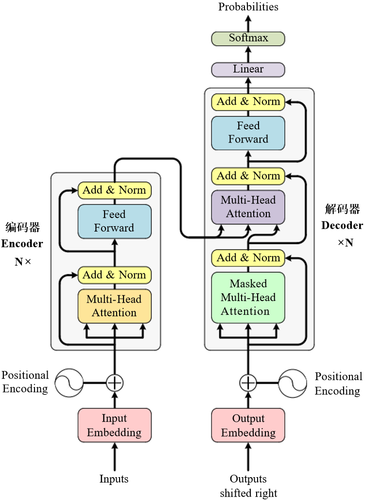
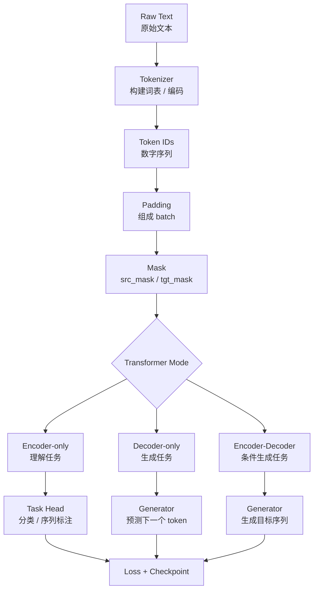
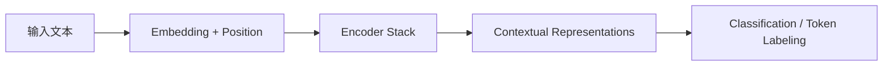
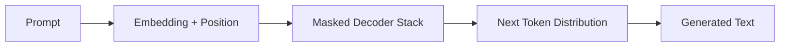
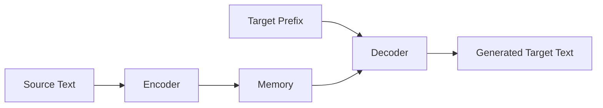
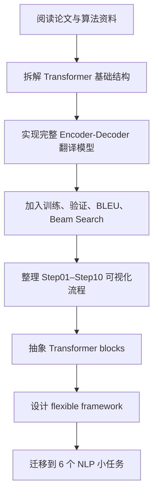

# 🧠 Primer on Transformer  
## 从理论拆解到翻译实验，再到灵活积木框架的研究札记

<div align="center">
    

    


**Transformer 到底是如何从一堆矩阵运算，变成一个能理解、生成、翻译文本的模型的？—— Attention Is All You Need!!**

</div>

---

## 📌 项目定位｜Transformer 的拆解、复现与再搭建

这个仓库记录的是我对 Transformer 的一次系统性研究与实验整理。

我没有只停留在论文公式层面，也没有直接调用现成的大模型接口，而是把 Transformer 拆成更小的模块，从 **Attention、Mask、Embedding、Position Encoding、Encoder、Decoder、Beam Search** 等部件开始，一步步完成了两个方向的工作：

| 模块 | 目录 | 我主要做了什么 | 体现的能力 |
|---|---|---|---|
| 🚀 **完整翻译实验** | `Transformer-Translate/` | 从零搭建 Encoder-Decoder Transformer，完成英中翻译训练、验证、BLEU 评估与 Beam Search 推理 | 理论复现、模型训练、实验评估、调参分析 |
| 🧩 **灵活积木框架** | `flexible_transformer_framework/` | 把 Transformer 拆成可复用 blocks，通过开关组合出 Encoder-only、Decoder-only、Encoder-Decoder 三类结构 | 模块抽象、任务迁移、工程组织 |
| 🖼️ **图示与资料整理** | `assets/` | 整理原理论文、算法文档、实战记录和 Step-by-Step 可视化图 | 知识结构化、可视化表达、研究总结 |

---

## 🗂️ 仓库结构｜一条从“理解”到“实验”再到“抽象”的路线

```text
PrimerOnTransformer_TheoryExp/
├── Transformer-Translate/
│   ├── data/
│   ├── model/
│   │   ├── tf_model.py
│   │   └── train_utils.py
│   ├── tokenizer/
│   ├── tools/
│   ├── beam_decoder.py
│   ├── config.py
│   ├── main.py
│   ├── translate.py
│   └── requirements.txt
│
├── flexible_transformer_framework/
│   ├── data/
│   ├── model/
│   │   ├── blocks.py
│   │   ├── config.py
│   │   ├── flexible_transformer.py
│   │   └── masks.py
│   ├── tasks/
│   │   ├── Encoder-only_tasks/
│   │   ├── Decoder-only_tasks/
│   │   └── Encoder-Decoder_tasks/
│   ├── train_all_demos.py
│   ├── test_all_demos.py
│   └── README.md
│
└── assets/
    ├── images/
    ├── 1706.03762v7.pdf
    ├── Transformer算法原理.pdf
    └── Transformer-Translate实战代码操作文档.docx
```

---

## 📥 资料下载｜论文、实验文档与图示素材

| 类别 | 文件 / 资源 | 内容说明 | 下载链接 |
|---|---|---|---|
| 📄 原论文 | `1706.03762v7.pdf` | Transformer 原论文 *Attention Is All You Need* | [Download PDF](https://raw.githubusercontent.com/yhe8479-ship-it/PrimerOnTransformer_TheoryExp/main/assets/1706.03762v7.pdf) |
| 📘 算法资料 | `Transformer算法原理.pdf` | Transformer 结构、注意力机制与算法原理整理 | [Download PDF](https://raw.githubusercontent.com/yhe8479-ship-it/PrimerOnTransformer_TheoryExp/main/assets/Transformer%E7%AE%97%E6%B3%95%E5%8E%9F%E7%90%86.pdf) |
| 🛠️ 实战文档 | `Transformer-Translate实战代码操作文档.docx` | 翻译实验代码说明、运行过程与操作记录 | [Download DOCX](https://raw.githubusercontent.com/yhe8479-ship-it/PrimerOnTransformer_TheoryExp/main/assets/Transformer-Translate%E5%AE%9E%E6%88%98%E4%BB%A3%E7%A0%81%E6%93%8D%E4%BD%9C%E6%96%87%E6%A1%A3.docx) |
| 🖼️ 图示目录 | `assets/images/` | Step01–10 流程图与注意力机制图 | [View Images Folder](https://github.com/yhe8479-ship-it/PrimerOnTransformer_TheoryExp/tree/main/assets/images) |

---

## 🚀 Part I｜完整翻译实验  

## 用一个真实翻译例子，把 Transformer 的关键阶段顺下来

这一部分围绕项目代码 `Transformer-Translate/` 展开。

我选择用一个具体翻译任务贯穿整个 Transformer 流程：

```text
English:
The government has implemented various policies to improve the living standards of its citizens.

Chinese:
政府实施了诸多政策，改善公民的生活水平。
```

这句话并不是简单的逐词替换。它涉及：

- `government` 和 `implemented` 的主谓关系；
- `implemented` 和 `policies` 的动作-宾语关系；
- `policies` 和 `improve` 的目的关系；
- `living standards` 和 `citizens` 的所属关系；
- 英文长定语结构到中文自然语序的重排。

因此，它很适合作为观察 Transformer 翻译过程的样本。

---

## 🧭 总览图｜Transformer 如何完成一次翻译？

<div align="center">



</div>

一次翻译可以看成一条“信息接力链”。下面，我们来把这条链路完整走一遍！Come on~

---

## 🌱 Step 01｜Input Embedding  
### 把英文 token 送进模型世界

<div align="center">


</div>

原始英文句子首先会被 tokenizer 转换成 token id：

```text
The government has implemented various policies ...
        ↓
[BOS, id_1, id_2, id_3, ..., EOS]
```

但是 token id 只是离散编号，本身没有语义距离。所以第一步需要通过 embedding 层，把每个 token 映射成连续向量：

```text
token id → dense vector
```

在我的翻译实验中，模型主维度设置为：

```python
d_model = 512
```

也就是说，每个 token 会被表示成一个 512 维向量。此时，句子已经从“文字序列”变成了“向量序列”。

可以这么理解：**Embedding 就像给每个词发了一张进入 Transformer 世界的身份证。** 只有变成向量，后面的注意力计算、矩阵乘法和梯度更新才有可能发生。

---

## 🧭 Step 02｜Positional Encoding  
### 给每个 token 标上“它站在哪里”

<div align="center">


</div>

Transformer 和 RNN 不同，它不会天然按时间顺序读句子。如果只输入 embedding，模型会知道有哪些词，却不知道这些词的顺序。

例如：

```text
policies improve citizens
citizens improve policies
```

两句话词表相近，但含义完全不同。因此，模型需要额外加入位置信息。

在这一阶段：

```text
Input Representation = Token Embedding + Positional Encoding
```

也就是说，每个 token 的最终输入表示中同时包含两类信息：

| 信息 | 作用 |
|---|---|
| Token Embedding | 这个词是什么 |
| Positional Encoding | 这个词在句子中的位置 |

我认为 Position Encoding 是 Transformer 中非常关键但容易被低估的一步。它解决的不是“词义”问题，而是“结构”问题。

---

## 🔍 Step 03｜Encoder Multi-Head Self-Attention  
### 让英文句子内部的词彼此建立联系

<div align="center">


</div>

到这一步，英文句子已经变成带有位置信息的向量序列。接下来，Encoder 要开始理解句子内部的关系。

在 Encoder Self-Attention 中，每个英文 token 都会观察同一句子里的其他 token。

以例句为例：

| 当前 token | 可能重点关注的 token | 关系 |
|---|---|---|
| `government` | `implemented` | 谁执行了动作 |
| `implemented` | `government`, `policies` | 主语与宾语 |
| `policies` | `implemented`, `improve` | 政策被实施，并用于改善 |
| `improve` | `policies`, `living standards` | 政策的目的 |
| `living standards` | `citizens` | 所属关系 |
| `its` | `government`, `citizens` | 指代与归属判断 |

Self-Attention 的核心思想可以概括为：

> 当前词不再孤立地理解自己，而是根据整句话重新更新自己的表示。

例如，`standards` 单独出现时只是“标准”；但当它和 `living`、`citizens` 出现在同一句中时，就更接近“生活水平”的含义。

这让我感受到 Transformer 的强大：**它不是逐词翻译，而是在翻译前先重建整句话的语义网络。**

---

## 🧱 Step 04｜Add & Norm  
### 一边吸收新信息，一边保留原始信息

<div align="center">


</div>

Self-Attention 之后，模型并不会直接把结果丢给下一层，而是经过 Add & Norm：

```text
Output = LayerNorm(x + Sublayer(x))
```

这里包含两个重要结构：

| 结构 | 作用 |
|---|---|
| Add / Residual Connection | 保留原始输入信息，缓解深层网络训练困难 |
| Norm / LayerNorm | 稳定每一层的数值分布，让训练更平稳 |

我在理解这一步时，把它看作一种“稳态机制”：

> Attention 负责大胆更新表示，Residual 和 Norm 负责防止模型在深层传播中迷路。

Transformer 通常会堆叠多层 Encoder 和 Decoder。如果没有残差连接，信息在层层变换中很容易衰减；如果没有归一化，训练时数值分布可能变得不稳定。

---

## 🔥 Step 05｜Encoder Feed Forward  
### 对每个位置做更深的非线性加工

<div align="center">


</div>

Self-Attention 解决的是“词与词之间如何交换信息”。Feed Forward Network 解决的是“每个位置吸收上下文后，如何进一步加工自身表示”。

在我的翻译模型中：

```python
d_model = 512
d_ff = 2048
```

因此 FFN 的维度变化大致是：

```text
512 → 2048 → 512
```

可以理解为：

1. 先把 token 表示扩展到更高维空间；
2. 经过非线性激活；
3. 再压回模型主维度。

如果说 Attention 像“开会交流”，那么 FFN 更像“每个成员会后自己消化总结”。它不再跨 token 交互，而是在每个位置内部增强表示能力。

---

## 🧠 Step 06｜Encoder Output Memory  
### 把英文句子编码成可查询的语义记忆

<div align="center">


</div>

经过多层 Encoder 后，英文句子中的每个 token 都不再只是原来的词向量，而是融合了上下文的新表示。

这组输出可以称为：

```text
Encoder Memory
```

它保存了源语言句子的语义结构。

对于例句来说，Encoder Memory 中已经包含了：

- `government` 是动作执行者；
- `implemented` 是核心动作；
- `policies` 是被实施的对象；
- `improve` 是目的；
- `living standards of its citizens` 是最终改善对象。

我把 Encoder Memory 理解成翻译过程中的“英文语义地图”。Decoder 后面生成中文时，并不是凭空生成，而是不断回头查看这张地图。

---

## 🌙 Step 07｜Output Embedding  
### Decoder 从中文起始符开始准备生成

<div align="center">


</div>

Encoder 处理的是英文输入，Decoder 处理的是中文输出。

训练时，目标中文句子通常会右移一位作为 Decoder 输入：

```text
Decoder Input:
BOS 政府 实施 了 诸多 政策 ...

Target Label:
政府 实施 了 诸多 政策 ， ...
```

也就是说，Decoder 学习的是：

> 在已经看到前面中文 token 的情况下，预测下一个中文 token。

对于例句，Decoder 不是一次性生成完整中文句子，而是一步步生成：

```text
BOS
BOS → 政府
BOS → 政府 → 实施
BOS → 政府 → 实施 → 了
...
```

这一点是理解生成任务的关键：**翻译结果不是直接“吐出来”的，而是在条件约束下一步步长出来的。**

---

## 🕶️ Step 08｜Decoder Masked Self-Attention  
### 中文生成时不能偷看未来答案

<div align="center">


</div>

Decoder 的 Self-Attention 和 Encoder 最大的区别是：Decoder 生成当前位置时，不能看到未来 token。

例如目标中文句子是：

```text
政府 实施 了 诸多 政策 ， 改善 公民 的 生活 水平 。
```

当模型正在预测“政策”时，它只能看到：

```text
BOS 政府 实施 了 诸多
```

不能看到后面的：

```text
， 改善 公民 的 生活 水平 。
```

这就是 Masked Self-Attention，也叫 Causal Self-Attention。

它保证模型训练时和真实推理时的逻辑一致：

| 阶段 | 允许看到什么 | 不允许看到什么 |
|---|---|---|
| 训练 | 当前 token 之前的目标 token | 未来目标 token |
| 推理 | 已经生成的中文前缀 | 尚未生成的中文 token |

---

## 🌉 Step 09｜Encoder–Decoder Cross Attention  
### 生成中文时，回头查询英文语义地图

<div align="center">


</div>

这是翻译任务中最精彩的一步！Decoder 不能只根据中文前缀生成，它还必须时刻参考英文原文。

**Cross Attention 就是连接 Encoder 和 Decoder 的桥，也是“交叉”的来源。**

在 Cross Attention 中：

```text
Q 来自 Decoder
K 来自 Encoder Memory
V 来自 Encoder Memory
```

也就是说，Decoder 每生成一个中文 token，都会向 Encoder Memory 提问：

> 我现在要生成下一个中文词，应该重点看英文原句中的哪些部分？

例如：

| 正在生成的中文 | Decoder 可能回看英文中的部分 |
|---|---|
| `政府` | `The government` |
| `实施了` | `has implemented` |
| `诸多政策` | `various policies` |
| `改善` | `to improve` |
| `公民的生活水平` | `the living standards of its citizens` |

这一步让我对翻译模型有了更直观的理解：

> Encoder 负责理解原文，Decoder 负责组织译文，Cross Attention 负责在两种语言之间建立对齐关系。

---

## 🎯 Step 10｜Prediction Head  
### 从隐藏状态到中文词表概率

<div align="center">


</div>

Decoder 输出的仍然是隐藏状态，还不是最终中文词。因此最后需要经过 Prediction Head，把每个位置的隐藏状态映射到目标词表空间：

```text
[batch, seq_len, d_model] → [batch, seq_len, tgt_vocab_size]
```

模型会为每个候选中文 token 给出一个概率分布，然后选择最合适的下一个 token。

例如在生成到：

```text
政府 实施 了 诸多
```

下一步候选可能包括：

| 候选 token | 可能性 |
|---|---|
| 政策 | 高 |
| 措施 | 中 |
| 方案 | 中 |
| 其他无关词 | 低 |

在推理阶段，我进一步使用 Beam Search，而不是简单贪心选择。这样可以保留多个候选路径，减少“当前一步看似最好，但整体句子不自然”这种问题。

---

# 🔍 关键机制复盘  
## 翻译过程中，真正起决定作用的几个 Attention 问题

上面已经按 Step01–Step10 走完了一次翻译。现在专门复盘几个关键机制：自注意力、多头注意力、掩码注意力和交叉注意力。

---

## 🪞 自注意力机制｜一句话内部如何互相理解？

<div align="center">


</div>

Self-Attention 的本质是：

```text
同一个序列内部，token 与 token 之间互相计算相关性。
```

在 Encoder 中：

```text
Q = K = V = 英文输入序列
```

以例句为例，`living standards` 之所以能被翻译成“生活水平”，不仅因为 `living` 和 `standards` 两个词本身，还因为它们和 `citizens` 形成了所属关系。

Self-Attention 让每个 token 都可以根据整句话重新理解自己。

| 词 | 单独看 | 放进上下文后 |
|---|---|---|
| `government` | 政府 | 动作执行者 |
| `policies` | 政策 | 被实施且用于改善生活水平的手段 |
| `improve` | 改善 | 政策实施的目的 |
| `standards` | 标准 | 与 living 组合成“生活水平” |
| `citizens` | 公民 | 生活水平的所属对象 |

---

## 👀 多头注意力机制｜不是一双眼睛，而是一组观察视角

<div align="center">


</div>

单头注意力只提供一种观察方式。多头注意力则让模型在多个子空间中同时观察句子。

我的完整翻译模型设置为：

```python
d_model = 512
n_heads = 8
d_k = 64
d_v = 64
```

这意味着 512 维表示会被拆成 **8 个注意力头**，每个头在 64 维空间中学习不同关系。

在这个翻译例子中，可以这样理解：

| Head | 可能关注的关系 | 例子 |
|---|---|---|
| Head 1 | 主谓关系 | `government` ↔ `implemented` |
| Head 2 | 动宾关系 | `implemented` ↔ `policies` |
| Head 3 | 目的关系 | `policies` ↔ `improve` |
| Head 4 | 名词短语关系 | `living` ↔ `standards` |
| Head 5 | 所属关系 | `standards` ↔ `citizens` |
| Head 6 | 代词指代 | `its` ↔ `government/citizens` |
| Head 7 | 长距离依赖 | 句首主语与后文结构 |
| Head 8 | 语序转换辅助 | 英文结构到中文表达的重排 |

我对多头注意力的理解是：**它让模型不是用一种规则理解句子，而是同时从语法、语义、位置、依赖关系等多个角度观察句子。**

---

## 🧱 Padding Mask｜不要让模型关注补齐出来的空白

<div align="center">


</div>

训练时一个 batch 中的句子长度不同，需要 padding 到相同长度：

```text
Sentence A: I like NLP <PAD> <PAD>
Sentence B: The government has implemented policies
```

如果模型把 `<PAD>` 当成真实 token，就会污染注意力分布。

Padding Mask 的作用是：

```text
真实 token：可以参与注意力计算
<PAD> token：不参与注意力计算
```

这类 mask 主要用于：

| 位置 | 是否需要 Padding Mask |
|---|---|
| Encoder Self-Attention | 需要 |
| Decoder Masked Self-Attention | 需要 |
| Cross Attention | 需要屏蔽 Encoder 中的 padding |

---

## ⏳ Causal Mask｜生成任务必须遵守时间顺序

<div align="center">

| 训练过程 | 推理过程 |
|---|---|
|  |  |

</div>

Causal Mask 主要出现在 Decoder 中。

它解决的问题是：

> 训练时目标句子是完整给出的，但模型不能因此偷看未来 token。

例如预测“政策”时：

```text
可见：BOS 政府 实施 了 诸多
不可见：， 改善 公民 的 生活 水平 。
```

这保证了模型学习到的是自回归生成逻辑，而不是依赖答案泄露。

---

## 🌉 交叉注意力机制｜源语言和目标语言之间的桥

<div align="center">


</div>

Cross Attention 是 Encoder-Decoder 架构的核心。

它与 Self-Attention 的区别在于：

| 注意力类型 | Q 来自哪里 | K/V 来自哪里 | 作用 |
|---|---|---|---|
| Encoder Self-Attention | 英文输入 | 英文输入 | 建模源语言内部关系 |
| Decoder Masked Self-Attention | 中文前缀 | 中文前缀 | 建模已生成目标语言关系 |
| Cross Attention | 中文 Decoder 状态 | 英文 Encoder Memory | 建立英文到中文的语义对齐 |

对于翻译任务来说，Cross Attention 的意义非常直观：

```text
生成中文时，每一步都回头查看英文原文。
```

这也是机器翻译和普通语言模型续写的一个重要区别。

---

## 🧪 翻译实验中的工程设计  
### 不只是模型结构，还包括训练、评估和推理闭环

`Transformer-Translate/` 中，我不仅实现了 Transformer 结构，还补齐了完整翻译实验需要的训练和推理流程。

| 模块 | 文件 | 作用 |
|---|---|---|
| Transformer 主体 | `model/tf_model.py` | 实现 Embedding、Positional Encoding、Attention、Encoder、Decoder、Generator |
| 训练入口 | `main.py` | 组织训练、验证、模型保存 |
| 单句推理 | `translate.py` | 输入英文句子并输出中文翻译 |
| Beam Search | `beam_decoder.py` | 在推理阶段保留多个候选翻译路径 |
| 参数管理 | `config.py` | 集中管理模型规模、训练参数、解码参数和路径 |
| 训练工具 | `model/train_utils.py` | 管理 loss、优化器、学习率等训练细节 |

---

## ⚙️ 参数配置与调参意识  
### 通过超参数观察模型能力、速度和稳定性的平衡

我的完整翻译实验中使用了以下关键配置：

| 参数 | 当前值 | 含义 | 我关注的问题 |
|---|---:|---|---|
| `d_model` | 512 | token 表示维度 | 表达能力和显存消耗的平衡 |
| `n_heads` | 8 | 多头注意力头数 | 是否能捕捉多种依赖关系 |
| `n_layers` | 6 | Encoder / Decoder 层数 | 深度是否足够表达复杂结构 |
| `d_ff` | 2048 | FFN 中间层维度 | 非线性加工能力 |
| `dropout` | 0.1 | 随机失活比例 | 防止过拟合 |
| `batch_size` | 32 | 批大小 | 训练速度和稳定性 |
| `epoch_num` | 3 | 训练轮数 | 快速验证完整流程 |
| `beam_size` | 3 | Beam Search 候选数 | 推理质量和推理速度的平衡 |
| `max_len` | 60 | 最大解码长度 | 控制译文长度 |

这些参数让我可以从实验角度观察几个问题：

- `beam_size` 增大后，译文是否更自然？
- `dropout` 是否能缓解小数据训练中的过拟合？
- `d_model` 和 `n_layers` 增大后，模型能力提升是否值得额外计算成本？
- BLEU 分数和主观翻译质量是否一致？
- 训练 loss 下降是否真的对应翻译质量提升？

这部分对我来说最重要的收获是：**Transformer 的研究不是只看结构图，还要看参数、数据、训练策略和解码方式如何共同影响最终结果。**

---

# 🧩 Part II｜Flexible Transformer Framework  
## 把 Transformer 拆成积木，再搭出不同 NLP 任务

如果说 `Transformer-Translate/` 是一次完整的“造机器”实验，那么 `flexible_transformer_framework/` 就是我把这台机器拆开后的“积木化重组”。

我想验证的是：

> Transformer 的核心 blocks 是否可以被抽象成统一模块，并通过不同组合适配不同 NLP 任务？

---

## 🧱 原材料｜我把 Transformer 拆成哪些 blocks？

`flexible_transformer_framework/model/blocks.py` 中整理了多个基础模块。

| 积木块 | 作用 | 可复用位置 |
|---|---|---|
| `TokenEmbedding` | token id 转换为向量 | Encoder / Decoder |
| `PositionalEncoding` | 加入位置信息 | Encoder / Decoder |
| `attention` | Scaled Dot-Product Attention | 注意力底层计算 |
| `MultiHeadedAttention` | 多头注意力 | Self-Attention / Cross-Attention |
| `PositionwiseFeedForward` | 逐位置前馈网络 | Encoder / Decoder |
| `SublayerConnection` | 残差连接 + LayerNorm + Dropout | 每个子层 |
| `EncoderLayer` | Self-Attention + FFN | Encoder-only / Encoder-Decoder |
| `DecoderLayer` | Masked Self-Attention + optional Cross-Attention + FFN | Decoder-only / Encoder-Decoder |
| `Encoder` | 堆叠多个 EncoderLayer | 理解类任务 |
| `Decoder` | 堆叠多个 DecoderLayer | 生成类任务 |

我对这部分的设计目标是：**每个 block 不只为一个任务服务，而是成为后续任务组合的通用零件。**

---

## 🎛️ 开关式配置｜用两个开关决定模型形态

核心配置来自 `FlexibleTransformerConfig`：

```python
@dataclass
class FlexibleTransformerConfig:
    use_encoder: bool = True
    use_decoder: bool = True
    src_vocab_size: int = 32000
    tgt_vocab_size: int = 32000
    d_model: int = 256
    n_heads: int = 8
    d_ff: int = 1024
    n_layers: int = 4
    dropout: float = 0.1
    max_len: int = 512
    pad_id: int = 0
```

其中最关键的是：

```python
use_encoder
use_decoder
```

这两个开关决定模型结构：

| `use_encoder` | `use_decoder` | 模型形态 | 是否有 Cross Attention | 对应任务 |
|---|---|---|---|---|
| ✅ True | ❌ False | Encoder-only | 无 | 文本分类、NER |
| ❌ False | ✅ True | Decoder-only | 无 | 语言模型、对话生成 |
| ✅ True | ✅ True | Encoder-Decoder | 有 | 翻译、摘要 |

这部分最有意思的地方在于：我不是为每个任务重新写一个 Transformer，而是通过配置控制“装哪些部件”。

---

## 🧭 从原始文本到任务输出｜统一数据流



无论是分类、NER、语言模型、对话、翻译还是摘要，底层都有一条统一逻辑：

```text
文本 → tokenizer → token ids → padding → mask → Transformer → task head → loss → checkpoint
```

真正变化的是：

- 使用 Encoder 还是 Decoder；
- 是否需要 Cross Attention；
- label 是句子级、token 级，还是序列级；
- loss 如何计算；
- 推理阶段如何生成输出。

---

## 🧪 六个任务｜同一盒积木搭出六种实验

| 任务 | 模型模式 | 数据目录 | 训练脚本 | 测试脚本 | 我重点验证什么 |
|---|---|---|---|---|---|
| 文本分类 | Encoder-only | `data/classification/` | `train_text_classification.py` | `test_text_classification.py` | 句子表示如何变成类别判断 |
| NER | Encoder-only | `data/ner/` | `train_ner.py` | `test_ner.py` | 每个 token 如何预测标签 |
| 语言模型 | Decoder-only | `data/language_model/` | `train_decoder_lm.py` | `test_decoder_lm.py` | causal mask 和 next-token prediction |
| 对话生成 | Decoder-only | `data/dialogue/` | `train_dialogue_generation.py` | `test_dialogue_generation.py` | Decoder 如何根据上下文生成回复 |
| 翻译 | Encoder-Decoder | `data/translation/` | `train_translation.py` | `test_translation.py` | 源序列到目标序列的条件生成 |
| 摘要 | Encoder-Decoder | `data/summarization/` | `train_summarization.py` | `test_summarization.py` | 长文本到短文本的压缩表达 |

这 6 个任务不是为了追求大规模 SOTA，而是为了验证我对 Transformer 结构的抽象是否成立：

> 如果一个框架真的抓住了 Transformer 的核心，那么它应该能通过不同组合适配多种任务。

---

## 🧠 三类架构｜理解、续写、条件生成

### 📘 Encoder-only｜读完整句子，再做判断



Encoder-only 适合理解类任务。因为它允许 token 双向互看，所以可以充分利用完整上下文。

典型任务：

- 文本分类；
- NER；
- 句子匹配；
- 情感分析。

---

### ✍️ Decoder-only｜只看过去，预测未来



Decoder-only 适合自回归生成。它的核心约束是 causal mask：只能看过去，不能看未来。

典型任务：

- 语言模型；
- 文本续写；
- 对话生成。

---

### 🌉 Encoder-Decoder｜先理解输入，再生成输出



Encoder-Decoder 适合条件生成。它先用 Encoder 理解输入，再用 Decoder 在 Cross Attention 的帮助下生成输出。

典型任务：

- 机器翻译；
- 文本摘要；
- 改写；
- 问答生成。

---

## 🎯 能力点&工作量

| 能力点 | 具体体现 |
|---|---|
| 模型拆解能力 | 将 Transformer 拆成 Embedding、Position、Attention、FFN、Encoder、Decoder 等独立 blocks |
| 抽象建模能力 | 用 `use_encoder/use_decoder` 控制模型结构，而不是重复写模型 |
| 多任务迁移能力 | 同一套底层结构支持 6 类 NLP 任务 |
| 数据流组织能力 | 每个任务都包含 tokenizer、padding、mask、label、loss、checkpoint |
| 实验验证能力 | 提供统一训练入口和统一测试入口，也保留单任务脚本 |
| 工程稳定性意识 | 小数据 demo 控制 CPU 线程，保证普通环境下也能稳定运行 |
| 研究总结能力 | 将完整翻译实验中的模块抽象出来，再迁移到多任务框架中验证 |

---

# 🧬 Part III｜我的研究路线  
## 从论文结构，到完整复现，再到模块抽象

整个项目可以概括为一条递进路线：



这条路线对应了我在项目中的三个阶段：

| 阶段 | 我做的事情 | 收获 |
|---|---|---|
| 理论拆解 | 阅读 Transformer 结构，整理 Attention、Mask、FFN、Encoder、Decoder | 搞清楚模型为什么这样设计 |
| 完整实验 | 实现英中翻译模型，加入训练、BLEU、Beam Search | 理解模型如何真正跑起来 |
| 模块抽象 | 把完整模型拆成 blocks，迁移到多任务框架 | 理解结构如何复用和扩展 |

---

# 🛠️ Part IV｜复现指南  
## 前面讲研究过程，这里讲如何复现

---

## 🚀 运行完整翻译实验：`Transformer-Translate`

### 1. 进入目录

```bash
cd Transformer-Translate
```

### 2. 安装依赖

```bash
pip install -r requirements.txt
```

如果国内环境安装较慢，可以使用清华源：

```bash
pip install -r requirements.txt -i https://pypi.tuna.tsinghua.edu.cn/simple
```

### 3. 训练模型

```bash
python main.py
```

训练过程中主要包括：

- 训练集 loss 计算；
- 验证集 loss 计算；
- Beam Search 解码；
- BLEU 评估；
- 保存最佳模型权重。

### 4. 单句翻译

```bash
python translate.py
```

示例输入：

```text
The government has implemented various policies to improve the living standards of its citizens.
```

目标翻译：

```text
政府实施了诸多政策，改善公民的生活水平。
```

---

## 🧩 运行灵活 Transformer 框架：`flexible_transformer_framework`

### 1. 进入目录

```bash
cd flexible_transformer_framework
```

### 2. 一键训练全部 demo

```bash
python train_all_demos.py
```

这个入口会依次训练 6 个任务，用于快速验证：

- 数据读取；
- tokenizer 构建；
- padding 和 mask；
- forward 流程；
- loss 计算；
- checkpoint 保存。

### 3. 一键测试全部 demo

```bash
python test_all_demos.py
```

### 4. 单独训练某个任务

```bash
python tasks/Encoder-only_tasks/train_text_classification.py --epochs 30
python tasks/Encoder-only_tasks/train_ner.py --epochs 30

python tasks/Decoder-only_tasks/train_decoder_lm.py --epochs 30
python tasks/Decoder-only_tasks/train_dialogue_generation.py --epochs 30

python tasks/Encoder-Decoder_tasks/train_translation.py --epochs 40
python tasks/Encoder-Decoder_tasks/train_summarization.py --epochs 40
```

### 5. 单独测试某个任务

```bash
python tasks/Encoder-only_tasks/test_text_classification.py --text "这个电影很好看"
python tasks/Encoder-only_tasks/test_ner.py --text "小明明天去北京"

python tasks/Decoder-only_tasks/test_decoder_lm.py --prompt "我明天"
python tasks/Decoder-only_tasks/test_dialogue_generation.py --context "你好"

python tasks/Encoder-Decoder_tasks/test_translation.py --text "我明天去北京。"
python tasks/Encoder-Decoder_tasks/test_summarization.py --text "今天北京天气晴朗，很多市民来到公园散步和运动，城市交通整体平稳。"
```

---

# 📦 Part V｜训练产物  
## 模型、tokenizer 与 checkpoint

训练完成后，任务目录下会生成相应的 `run/` 产物，通常包括：

```text
model.pt
tokenizer.json
src_tokenizer.json
tgt_tokenizer.json
```

| 文件 | 说明 |
|---|---|
| `model.pt` | 训练后的模型权重 |
| `tokenizer.json` | 单输入任务 tokenizer |
| `src_tokenizer.json` | Encoder-Decoder 任务的源语言 tokenizer |
| `tgt_tokenizer.json` | Encoder-Decoder 任务的目标语言 tokenizer |

---

# 🌟 Part VI｜项目总结  
## 这次实验让我真正理解了什么

通过这个项目，我对 Transformer 的理解不再停留在“Attention is All You Need”这句话本身，而是更具体地落到了以下问题上：

- Embedding 和 Positional Encoding 如何把文本送入模型；
- Self-Attention 如何让 token 在句子内部建立关系；
- Multi-Head Attention 如何从多个角度观察同一句话；
- Padding Mask 和 Causal Mask 分别解决什么问题；
- Cross Attention 如何连接源语言和目标语言；
- Beam Search 为什么能改善生成质量；
- Encoder-only、Decoder-only、Encoder-Decoder 为什么适合不同任务；
- 一个完整模型如何被拆成可复用 blocks；
- 一个实验项目如何从理论理解走向工程复现，再走向框架抽象。

---

## 🧭 后续可以继续探索的方向

后续我希望继续补充：

- attention heatmap 可视化；
- loss 曲线与 BLEU 曲线记录；
- `beam_size`、`dropout`、`n_layers` 的消融实验；
- Greedy Search、Beam Search、Top-k、Top-p 的生成对比；
- label smoothing；
- 更大规模数据集实验；
- 命令行参数管理；
- 更多任务扩展，如文本匹配、问答、改写等。

---

## 🏁 一句话总结

> **这个项目是我对 Transformer 的一次完整研究记录：先拆解原理，再完成翻译实验，最后把模型积木化，迁移到多个 NLP 小任务中验证。**

它记录的不只是模型能跑通，而是我如何一步步理解 Transformer -> 复现 Transformer -> 再重新组织 Transformer。

欢迎与我共同学习~

欢迎讨论指正~
